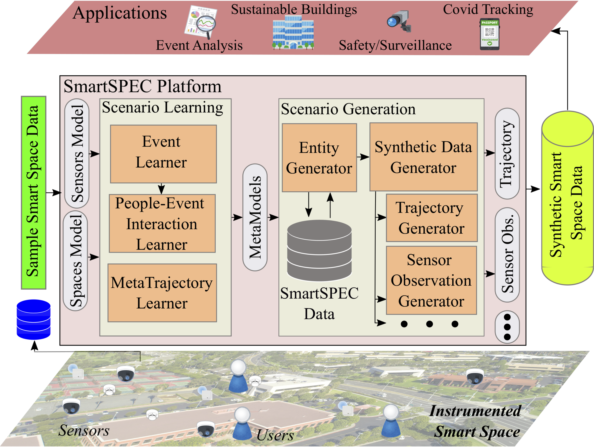
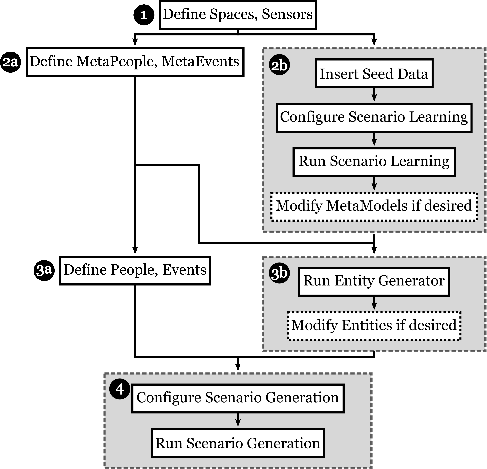

---
# Page title
title: SmartSPEC

# Page summary for search engines.
summary: Overview of the SmartSPEC smart space simulator and data generator.  

# Date page published
date: 2023-01-01

# Book page type (do not modify).
type: book

# Position of this page in the menu. Remove this option to sort alphabetically.
weight: 0

---

## Overview

*SmartSPEC* is a smart space simulator and data generator that creates customizable smart space datasets using semantic models of spaces, people, events and sensors. We employ ML-based approaches to characterize and learn attributes of the embedded people and events in a sensorized space and apply an event-driven simulation strategy to generate realistic simulated data about the space (e.g., events, trajectories, sensor datasets, etc.).

## SmartSPEC Architecture

The *SmartSPEC* architecture consists of two main components:

* [*Scenario Learning*](scenario-learning), which uses input seed connectivity data and a priori models of the underlying space and sensors to learn higher-order concepts of events, people and trajectories, which we refer to as "metaevents", "metapeople" and "metatrajectories", respectively.

* [*Scenario Generation*](scenario-generation), which takes *SmartSPEC* metamodels to generate a smart space dataset (i.e., trajectory dataset, sensor observation dataset). Variations of the [data models](data-models) are used to define various hypothetical scenarios, which drives the generation of new observable phenomena in the smart space. 

## Using SmartSPEC

SmartSPEC provides three modes of operation to generate synthetic data, varying in the level of user involvement/automation. The steps to use our system are as follows:

* Define the simulated space and its embedded sensors (1).
* Define MetaPeople and MetaEvents manually (2a) or automatically (2b).
* Define specific people and events based on the previous metamodels manually (3a) or automatically (3b).
* Configure the simulation and automatically generate synthetic datasets (4).

> [!NOTE]
> Please see the [*GUI Toolkit*](gui-toolkit) for help in manually defining/modifying the models necessary for SmartSPEC. 

