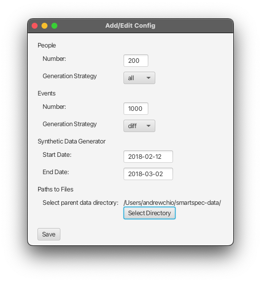
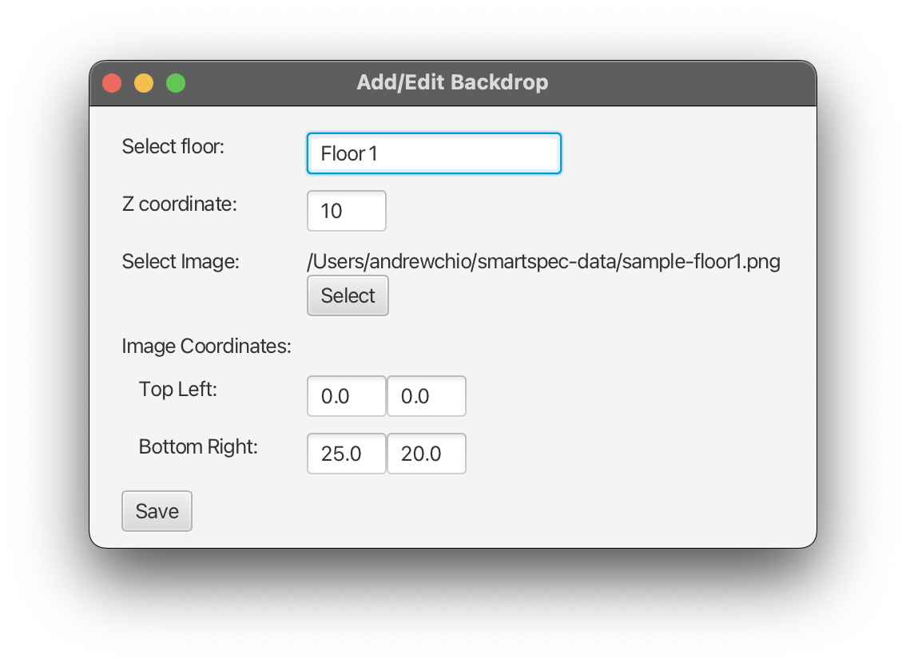
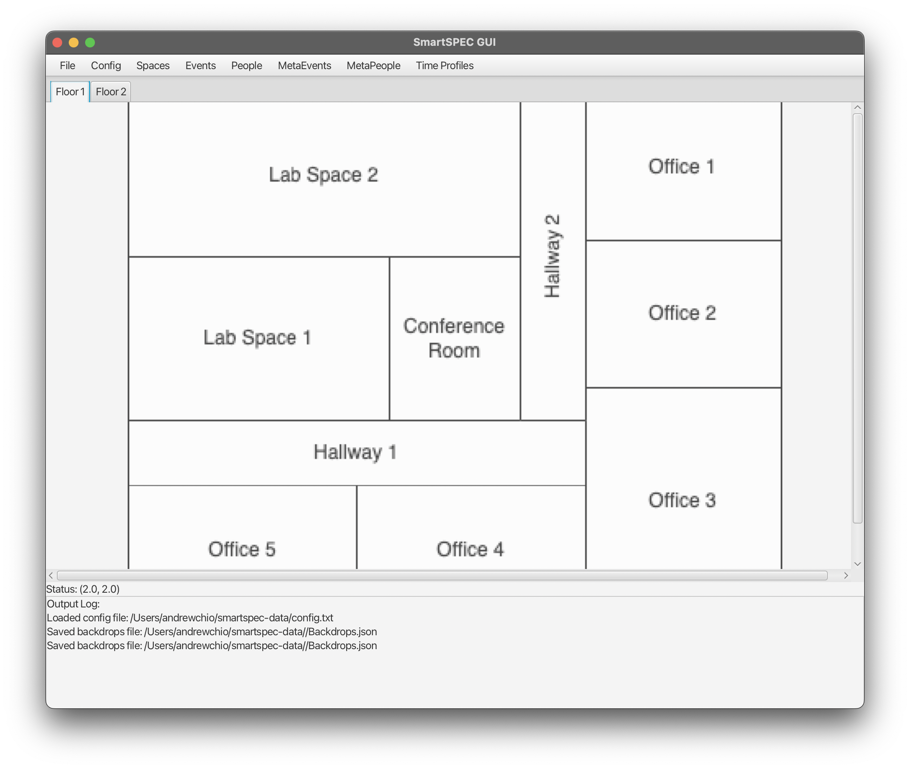
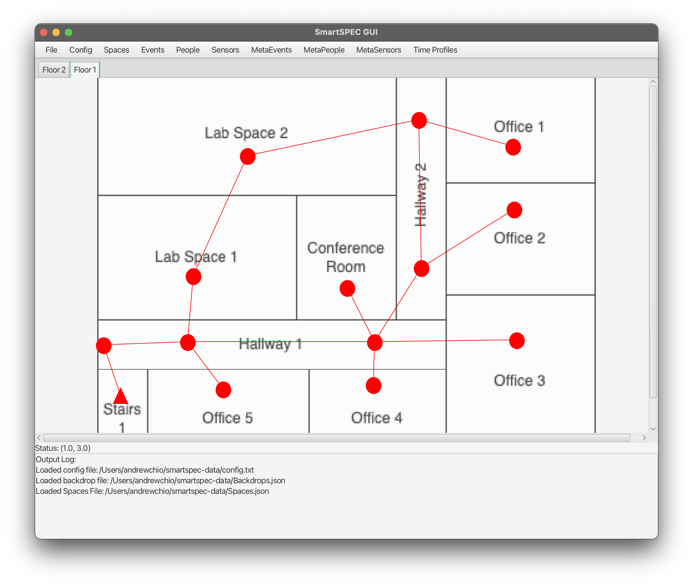
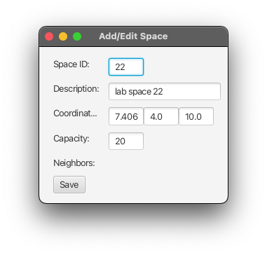
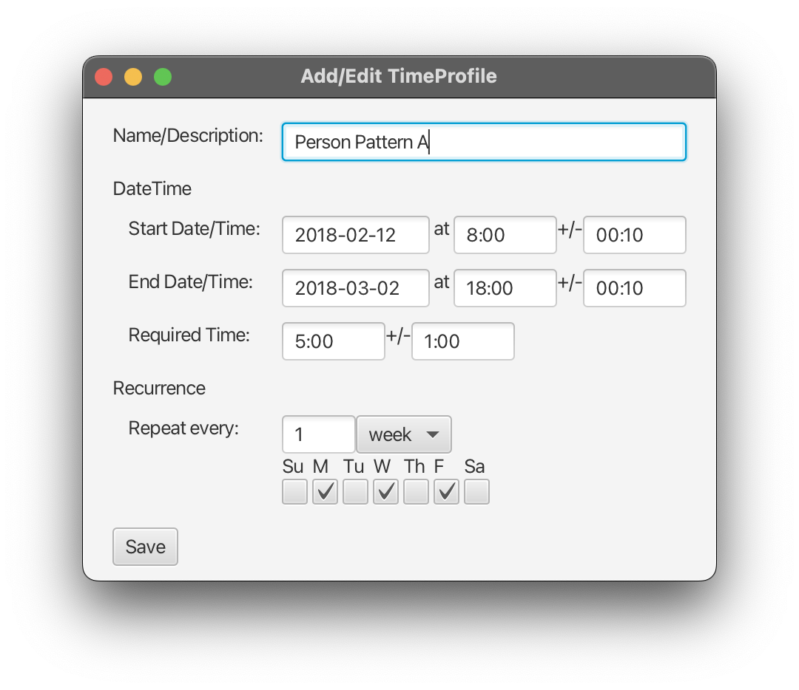
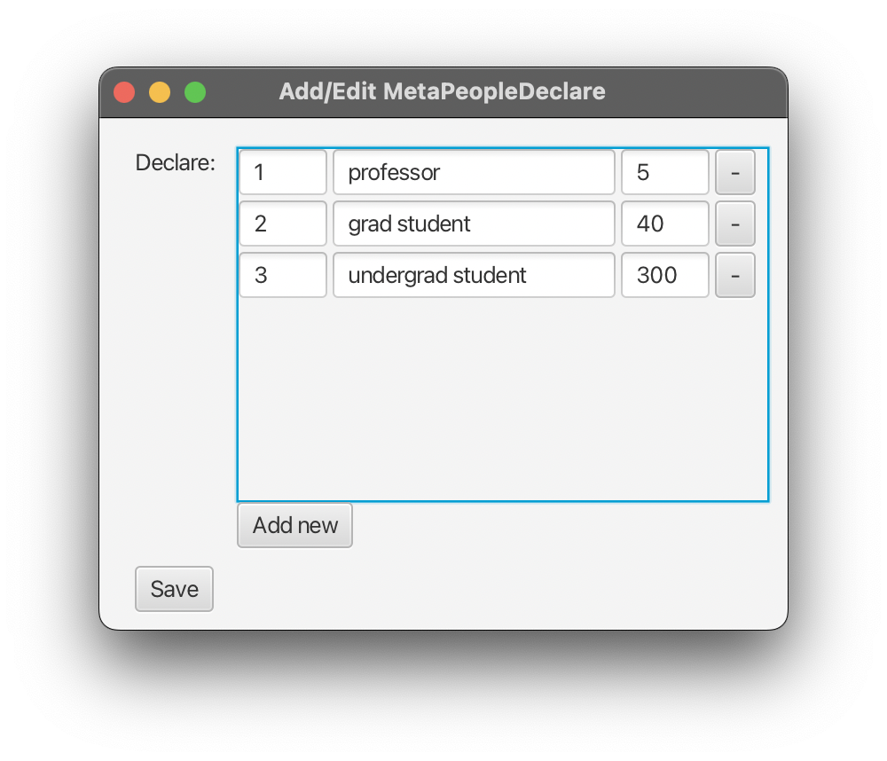
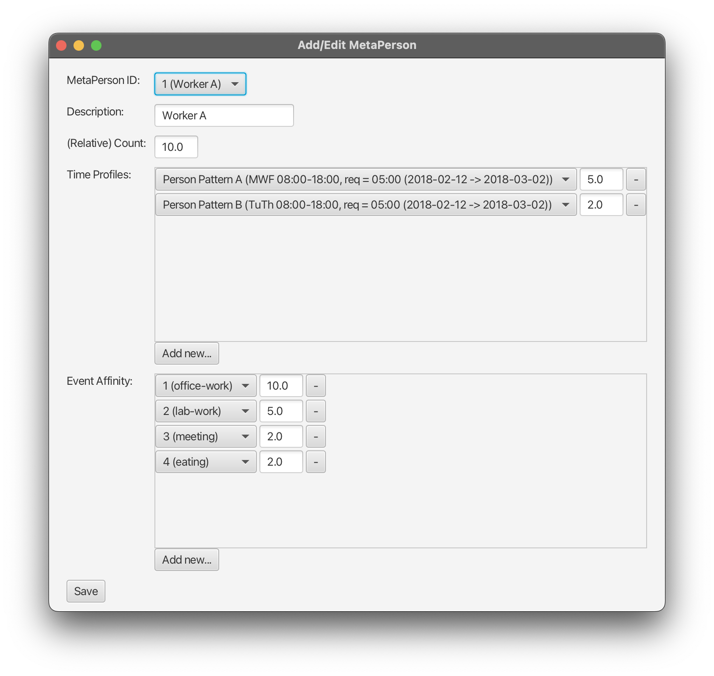
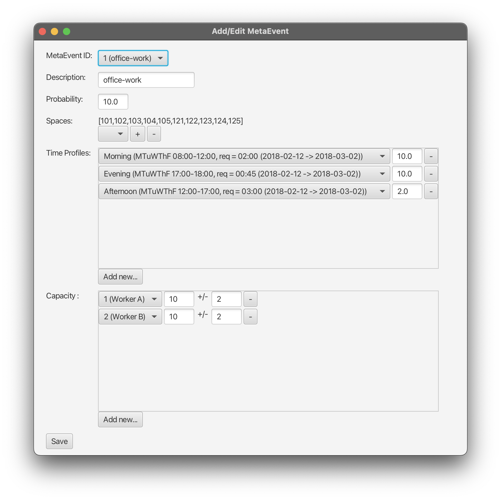

---
# Page title
title: GUI Toolkit

# Page summary for search engines.
summary: GUI Toolkit to define/modify SmartSPEC data models

# Date page published
date: 2023-01-01

# Book page type (do not modify).
type: book

# Position of this page in the menu. Remove this option to sort alphabetically.
weight: 50

---

## Overview

To aid in the manual definition/modification of SmartSPEC data models, we provide a SmartSPEC GUI Toolkit. See below for details.

## Tutorial

In this tutorial, we will describe how the SmartSPEC GUI can be used to generate a scenario. The tutorial scenario and its corresponding data can be found in the [SmartSPEC GitHub Repository](https://github.com/andrewgchio/SmartSPEC). The source code is located in the `gui-src` directory, while the data is in the `scenario-generation/data/data-gui` directory. 

### Setting up the Configuration file

The SmartSPEC GUI first requires that a configuration file is defined or loaded. This configuration file will contain information about how people and events should be automatically generated, the duration that the simulation should run, and the paths to other required input files. To initialize a configuration file, start by going to **Config > Add/Edit Config**. This will create a new window with several configuration options, as seen below.

<figure>
    
    <figcaption align="center">Input form for Config File.</figcaption>
</figure>

* **People and Events**. In the configuration options for people and events, two main entry fields are presented: `Number` and `Generation Strategy`. The `Number` field indicates the number of people / events that should be in the designed scenario, and must be set to a non-negative integer. The `Generation Strategy` field indicates the manner in which people / events will be produced. It must be set to one of "all", "diff", or "none". If the generation strategy is set to "all", then `Number` new people / events will be produced. If the generation strategy is set to "diff", then one person / event from each metaperson / metaevent will first be generated (up to `Number`), followed by additional people / events (up to `Number`). If the generation strategy is set to "none", then manually defined people / events will be used. Note that `Number` should still be set to "0" in this case.

> [!NOTE]
> *Tip*: It is recommended that the generation strategy for both people and events are set to either "all" or "diff" to reduce manual effort. 

* **Synthetic Data Generator**. In the configuration options for the synthetic data generator, the start / end date should be specified. These indicate the start / end dates of the entire simulation. Both dates must be in the format `YYYY-MM-DD`, and the start date must be before the end date.

* **Paths to Files**. The last configuration option requires a parent (base) directory in which all other input files should be located. Click the "Select Directory" button and select the directory to store all other input files. The selected directory should be displayed in the config menu window afterwards.

> [!NOTE]
> *Tip*: It is recommended that the SmartSPEC GUI is run on the same machine in which the SmartSPEC code will be run, since absolute file paths to SmartSPEC input will be recorded in the configuration file. 

**Saving**. After all configuration options are specified, click the "Save" button to save the configuration file. If this is successful, then the SmartSPEC GUI should display "Saved config file: `config-filepath`" in the output pane. By default, the name of the configuration file is set to `config.txt`. 

**Loading**. If a configuration file has already been defined, then it can be loaded by going to **Config > Load Config File**, which will open a prompt to select a configuration file. If this is successful, then the SmartSPEC GUI should display "Loaded config file `config-filepath`" in the output pane. 

> [!NOTE]
> **Important**: The base directory specified in the loaded configuration file (under `filepaths/generated-files`) should be the same as the directory where the configuration file exists. 

### Setting up Spaces and Backdrops

After setting up the configuration files, the underlying space in which the simulation will take place should be defined. This will consist of two main steps: loading space backdrops and defining a space graph. 

#### Backdrops

Space backdrops are images of the layout / floor plan of the space. They are used to indicate where certain spaces should be located. A new space backdrop can be loaded by going to **Spaces > Load Backdrop**. This will create a new window as shown below. 

<figure>
    
    <figcaption align="center">Input form for Backdrop File.</figcaption>
</figure>

* **Floor**. The floor entry is used to provide a semantic name for the floor to define. It will be displayed in the title of the tab dedicated to the provided backdrop. The floor name cannot contain parenthesis and must be unique (i.e., duplicate floor names should not be used).

* **Z-Coordinate**. The z-coordinate represents the "height" of the floor, or the distance (e.g., in meters) above ground level. Similar to the floor name, the z-coordinate should be unique for each backdrop. 

> [!NOTE]
> **Important**: The z-coordinates used for different floors should be on the same "scale" defined as for image coordinates (e.g., in meters). 

* **Image**. The image data entry prompts for an image to display as the layout of the floor. Click the "Select" button to select the backdrop image. The selected file name should be displayed in the backdrops form window afterwards.

> [!NOTE]
> The size (i.e., width, height) of the uploaded image must be modified as desired before loading it into the SmartSPEC GUI. Resizing the image in the GUI is not yet supported.

* **Coordinates**. The image coordinates are used to define the top left / bottom right corners of the image. Conceptually, these numbers should define the physical location of the top left / bottom right corner (e.g., in meters). The xy-coordinate specified for the bottom right corner must be *larger* than the xy-coordinate specified for the top left corner in value (i.e., x-coordinates will increase by going right; y-coordinates will increase by going down). 

> [!NOTE]
> **Important**: The coordinates specified here should be on the same "scale" defined as for z-coordinates (e.g., in meters).

**Saving**. After all data entries are entered, click the "Save" button to save the backdrop. If this is successful, then the SmartSPEC GUI should display "Saved backdrops file: `backdrops-filepath`" in the output pane, and the new backdrop should be displayed in the main window, as shown below. 

<figure>
    
    <figcaption align="center">SmartSPEC GUI after defined backdrop.</figcaption>
</figure>

#### Space Nodes and Edges

SmartSPEC internally uses a space graph to represent logical spaces and their neighbors. An example of a fully defined space graph can be seen below. In general, this must be done visually on the loaded space backdrop.

<figure>
    
    <figcaption align="center">SmartSPEC GUI after defined spaces.</figcaption>
</figure>

* **Adding a new space node**. To add a new space node, right-click on an appropriate location on the space backdrop, and select the context menu item to add a new space (i.e., **Right-Click > Add new space**). This will open a new window with partially-filled data entries for a new space, as seen below. The `description` field is optional and serves as a semantic label for the space; the `capacity` field must be a non-negative integer representing the maximum number of people that can physically be in the room. 

<figure>
    
    <figcaption align="center">Input form for Space File.</figcaption>
</figure>

> [!NOTE]
> After a space is added, hovering over a space node will show a small tooltip with the ID and description of the space. 

> [!NOTE]
> A pink circle will be temporarily drawn on the space backdrop as a placeholder for the location of the new space. This will turn into a red circle after the space is properly initialized. 

> [!NOTE]
> Spaces must all have a unique ID. Once a space is created, it cannot change its ID. 

> [!NOTE]
> **Important**: One of the space nodes defined must be the special "outside" space node from which all people enter / exit the smart space. It is recommended to set the capacity to some large number. 

* **Editing a space node**. If a previously defined space node needs to be edited, then right-click on the node and select the option to `Edit space XX`. This will open another window with the data associated with the selected space. 

> [!NOTE]
> ID field of an edited space cannot be modified; delete the node and create a new one if the ID needs to be changed. 

* **Deleting a space node**. If a previously defined space nodes needs to be deleted, then right-click on the node and select the option to `Delete space XX`. The node and its associated edges should be then removed. 

* **Space Edges on the same floor**. After adding space nodes in the SmartSPEC GUI, space edges (which indicate that a person can travel directly between the two spaces) can be defined by clicking one node, dragging the line that is drawn to another node, and releasing. If the two nodes are not yet neighbors, then adding an edge between them will make them neighbors. Otherwise, if an edge already exists between the two nodes, it will be deleted. 

> [!NOTE]
> *Tip*: It is recommended that all space nodes are defined first, before neighbors are added. 

* **Space Edges between different floors**. The SmartSPEC GUI calls nodes that can be used to access different floors a "z-neighbor". Conceptually, z-neighbor nodes should represent stairs, elevators, etc. To add a z-neighbor, right click on a node and select the option to `Add new z-neighbor`. Then, select the space (on a different floor) to add as a z-neighbor. Similarly, z-neighbors can be removed by right-clicking on a node and selecting the option to `Delete z-neighbor`. The output pane will display appropriate messages if successful. 

> [!NOTE]
> A space that has a z-neighbor to a floor above or below it will be denoted with a triangle pointing up or down, respectively. A space that has a z-neighbor to floors above and below it will be denoted with a diamond. 

> [!NOTE]
> **Important**: If there are multiple floors to simulate, at least one node on each floor should be a z-neighbor to another floor in order to be reachable. 

**Saving**. By default, the spaces JSON file is not saved after each change to the spaces graph. Instead, go to **Spaces > Save Spaces File** to write the spaces JSON file. If successful, the output pane should display "Saved spaces file: `spaces-path`". 

**Loading**. If a spaces JSON file has already been defined, then it can be loaded by going to **Spaces > Load Spaces File**. This will open a prompt to select a spaces JSON file, and if successful, will display "Loaded spaces file: `spaces-path`". 

### Setting up MetaEvents and MetaPeople

After setting up the spaces graph, the metaevents and metapeople for the simulated scenario should be defined. This will consist of three steps: setting up time profiles, declaring both metaevents and metapeople, and then refining metaevents / metapeople. 

#### Setting up Time Profiles

Time profiles are used by both metaevents and metapeople to specify when an event would occur, and when a person enters / exits the smart space, respectively. The general definition for both metaevents and metapeople are the same, as they both indicate periods of time. 

<figure>
    
    <figcaption align="center">Input form for Time Profiles.</figcaption>
</figure>

* **Defining Time Profiles**. To define a new time profile, click **Time Profiles > Add New Time Profile**, which will open a new window with a time profile form. The `Name / Description` entry is used provide a semantic label for the time profile, and should not contain parenthesis. The `Start Date/Time` and `End Date/Time` data fields are used to indicate the start date/time and end date/time for the time profile. In general, a date should be provided in the first box, the mean time in the second box, and a standard deviation time in the third box. Dates should be in the format `yyyy-MM-dd`, while times should be in the format `HH:MM`. 
The entries for required time need two times (a mean time and a standard deviation time), and indicates the amount of time to spend between the given start/end time. 
The recurrence field is used to indicate the frequency of the time profile. Two recurrent patterns are provided: "day" and "week". If "week" is selected, then the days of the week must also be specified. The figure above shows an example of the data entries for time profiles. 

> [!NOTE]
> The SmartSPEC GUI provides a simplified view of time profiles. Currently, it does not support recurrence for months or years. 

> [!NOTE]
> *Tip*: Both time profiles for metaevents and metapeople must be defined in this step. It is recommended that the time profiles for metaevents generally span significantly less time than metapeople. This is since a time profile for an event determines when it occurs in the day, while a time profile for a person determines when they are in the smart space. 

**Saving**. In general, time profiles are not saved into a file after definition. Instead, go to **Time Profiles > Save Time Profile File** to write a time profile file. The default name for a time profile file is `TimeProfiles.json`. 

> [!NOTE]
> The format in which time profiles are saved in this file is *not* the same as the format in which time profiles need to be saved for metaevents and metapeople. 

**Loading**. If a time profile JSON file has already been defined by the SmartSPEC GUI previously, then it can be loaded by going to **Time Profiles > Load Time Profiles File**. This will open a prompt to select a time profiles JSON file. If successful, the output pane will display "Loaded time profiles file: `time-profiles-file`".

> [!NOTE]
> The format in which time profiles are saved in this file is *not* the same as the format in which time profiles need to be saved for metaevents and metapeople. 

### Declaring MetaEvents and MetaPeople

Since both metaevents and metapeople rely upon each other, the SmartSPEC GUI requires that users first "declare" all the different metaevents and metapeople for the simulation. In general, this will ease the difficulty in later defining proper metaevents and metapeople. To declare metaevents, go to **MetaEvents > Declare MetaEvents**. Similarly, to declare metapeople, go to **MetaPeople > Declare MetaPeople**.

The declaration form for both metaevents and metapeople are in the same format as seen below.

<figure>
    
    <figcaption align="center">Input Declaration form for MetaPeople.</figcaption>
</figure>

* **MetaEvent ID / MetaPerson ID**. The leftmost data entry box is for the metaevent ID / metaperson ID. This should be a unique integer with respect to the metamodel. 

> [!NOTE]
> *Tip*: While a metaevent and a metaperson may have the same "id", it is recommended to keep them separate for ease of interpretation. 

* **Description**. The middle data entry box should contain a semantic description of the metaevent / metaperson. 

* **Probability**. The third data entry box should contain the "probability" of each metaevent / metaperson in the simulated space. In particular, the "probability" for a metaevent is the expected number of derived events of the given metaevent type. On the other hand, the "probability" for a metaperson denotes the proportion of the population that is expected to be of given metaperson type. 

> [!NOTE]
> The total "probability" across all metaevents / metapeople does *not* need to sum to 1; the SmartSPEC simulator will normalize the input numbers. 

* **Adding / Removing entries**. To add a new row, click on the `Add new` button located towards the bottom of the window. On the other hand, to remove a particular row, click on the button "-" to right of the desired row. 

**Saving**. After declaring all relevant metaevents / metapeople, click "Save" at the bottom of the window to process all entries. The output pane will list all metaevents / metapeople that were properly declared. 

> [!NOTE]
> **Important**: All relevant metaevents / metapeople should be declared upfront with the correct ID during this step. Currently, we do not support modification of declared entry IDs (after saving). 

### Refining MetaEvents and MetaPeople

Once all metaevents and metapeople are declared, both metaevents and metapeople must be individually refined to properly be initialized. To edit a metaevent, go to **MetaEvents > Edit MetaEvent...**. Similarly, to edit a metaperson, go to **MetaPerson > Edit MetaPerson...**. Examples for the metapeople and metaevents forms can be seen below. 

<figure>
    
    <figcaption align="center">Input form for MetaPeople.</figcaption>
</figure>

<figure>
    
    <figcaption align="center">Input form for MetaEvents.</figcaption>
</figure>

The form for metaevents should be filled as follows, for each declared metaevent: 

* **MetaEvent ID, Description, and Probability**. Using the dropdown entry box for the metaevent ID, a particular metaevent to edit should be selected. The description and probability are then filled in according to the data provided to the declaration form. 

* **Spaces**. The dropdown menu should be used to select the different types of spaces in which the metaevent could be hosted. The "+" and "-" buttons are used to add / remove the selected space. The list of spaces in which the metaevent can occur are listed next to the data entry boxes. 

* **Time Profiles**. To add time profiles for the metaevent, click `Add new...`, which will create a new row in the time profiles entry box. Here, a profile should be selected, and its relative probability should be entered. A time profile can be removed by clicking the button with "-". Duplicate time profiles should not be entered. 

* **Capacity**. The attendance capacity in the "Capacity" entry box is used to indicate requirements for event attendance. Click on `Add new...` to add a new attendance capacity requirement. Then, use the dropdown menu to select a metaperson. The first text field indicates the average maximum capacity of the given type of metaperson, while the second text field indicates a corresponding standard deviation. Rows can be removed by clicking the "-" button. 

**Saving**. By default, the metaevents JSON file is not saved after each individual metaevent is edited. Go to **MetaEvents > Save MetaEvents File** to write the metaevents file. The output pane should display "Saved metaevents file: `<metaevents-path>`" if successful. 

The form for metapeople should be filled as follows, for each declared metaperson: 

* **MetaPerson ID, Description, and Counts**. Using the dropdown entry box for the metaperson ID, a particular metaperson to edit should be selected. The description and relative count (i.e., proportion of the population) are then filled in according to the data provided to the declaration form. 

* **Time Profiles**. The process to add time profiles to metapeople is similar to that for metaevents. In particular, to add time profiles for the metaperson, click `Add new...`, which will create a new row in the time profiles entry box. Here, a profile should be selected, and its relative probability should be entered. A time profile can be removed by clicking the button with "-". Duplicate time profiles should not be entered. 

* **Event Affinity**. Each metaperson should indicate their affinity towards different metaevent types. To add a new affinity, click `Add new...` for the capacity data entry field, which will create a new affinity data entry row. Use the dropdown to select the metaevent, and enter the corresponding affinity in the text box. In general, the affinity should be a non-negative floating point number (or integer, if desired), that relatively denotes the probability of attending different types of metaevents. Duplicate metaevents should not be listed. 

**Saving**. By default, the metapeople JSON file is not saved after each individual metaperson is edited. Go to **MetaPeople > Save MetaPeople File** to write the metapeople file. The output pane should display "Saved metapeople file: `<metapeople-path>`" if successful. 

After all appropriate metapeople and metaevents are defined and saved, the SmartSPEC scenario generation code can be run with the config file as generated by the SmartSPEC GUI.

## Running the GUI Toolkit

The GUI Toolkit should be run in the `gui-src` directory. See compilation and run instructions below.

### Linux Command Line

Compile: 
```bash
javac \
    -cp "<path-to-json-simple>:<path-to-ini4j>" \
    --module-path <path-to-javafx> \
    --add-modules javafx.controls \
    controller/*.java \
    form/*.java \
    model/*.java \
    modelutils/*.java \
    view/*.java \
    viewutils/*.java \
    application/Main.java
```

> [!NOTE]
> The multiline separator (`\`) is used for clarity and can be omitted. 

Run:
```bash
java \
    -cp ".:<path-to-json-simple>:<path-to-ini4j>" \
    --module-path <path-to-javafx> \
    --add-modules javafx.controls \
    application.Main
```
> [!NOTE]
> Note the following: 
> * the classpath is prefixed by `.:`
> * `application.Main` is used as the main program


### Windows Command Line

Compile: 
```bash
javac \
    -cp "<path-to-json-simple>;<path-to-ini4j>" ^
    --module-path <path-to-javafx> ^
    --add-modules javafx.controls ^
    controller\\*.java ^
    form\\*.java ^
    model\\*.java ^
    modelutils\\*.java ^
    view\\*.java ^
    viewutils\\*.java ^
    application\\Main.java
```

> [!NOTE]
> The multiline separator (`^`) is used for clarity and can be omitted.

Run: 

```bash
java \
    -cp ".;<path-to-json-simple>;<path-to-ini4j>" \
    --module-path <path-to-javafx> \
    --add-modules javafx.controls \
    application.Main
```

> [!NOTE]
> Note the following: 
> * the classpath is prefixed by `.;`
> * `application.Main` is used as the main program

### Using an IDE

In general, you must: (i) add the jar dependencies to the build path of the project; and (ii) add the arguments `--module-path <path-to-javafx> --add-modules javafx.controls` to the run configurations. 
